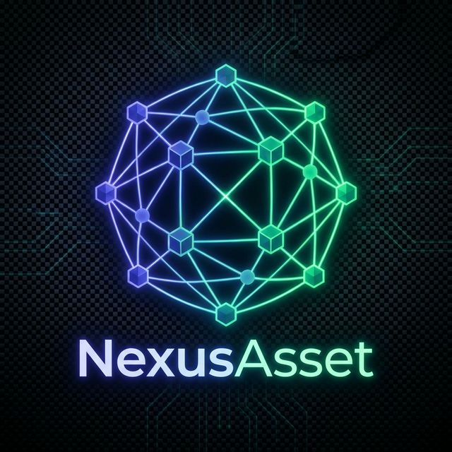

<div align="center">
  
  <h1>NexusAsset</h1>
  <p><strong>Enterprise IT Asset, Software, and Integration Catalog</strong></p>
  <p>
    
    
    
    
  </p>
</div>

---

NexusAsset is a comprehensive IT Catalog Management System designed to map and manage your organization's digital footprint. It replaces fragmented spreadsheets with a single, queryable source of truth for software deployments, server infrastructure, vendor contracts, database instances, and integration maps.

## 🌟 Key Features

*   **Software Catalog Registry:** Track in-house and third-party software with full ownership, deployment environments, and tech stack mapping.
*   **Infrastructure Management:** Inventory servers (Bare Metal, VMs, Cloud) with real-time CPU/RAM metrics and active/inactive status.
*   **Vendor & License Tracking:** Never miss a renewal with vendor contract tracking and automatic 90-day license expiry alerts.
*   **Integration Flow Maps:** Visualize source-to-target API and database connections with protocol and dependencies tracking.
*   **Executive Dashboard:** High-level widgets, asset criticality breakdowns, and EOL software warnings.
*   **Compliance & Audit:** 
    *   **Auto-Audit:** Immutable middleware tracking every system mutation (Create/Update/Delete).
    *   **ISO 27001 Exports:** 1-click JSON/CSV exports mapped to Annex A.8.3 (Information Asset Management).
*   **RBAC Security:** Role-based access control (Admin, Contributor, Reader) enforcing lowest-privilege operational standards.

## 🏗️ Technical Stack

*   **Backend:** Go 1.24, Chi Router, pgx/v5 (PostgreSQL), JWT Authentication.
*   **Frontend:** Next.js 15 (App Router), React 19, Tailwind CSS, Zustand, TanStack Query, Shadcn/ui.
*   **Database:** PostgreSQL 16 (relational schema with complex joins and JSONB).
*   **Deployment:** Docker and Docker Compose ready.

## 🚀 Quickstart via Docker

The easiest way to run the entire NexusAsset stack (Postgres + Backend API + Next.js Frontend) is using Docker Compose.

1.  **Clone the repository:**
    ```bash
    git clone https://github.com/YASSERRMD/NexusAsset.git
    cd NexusAsset
    ```

2.  **Start the services with Docker Compose:**
    ```bash
    docker-compose up -d --build
    ```
    *This will spin up a PostgreSQL instance, run the database migrations, seed the initial lookup data, start the Go backend on port `8080`, and start the Next.js frontend on port `3000`.*

3.  **Access the Application:**
    *   Frontend: `http://localhost:3000`
    *   Backend API: `http://localhost:8080/api/v1`
    
4.  **Login Credentials (Default Seed):**
    *   **Email:** `admin@nexus.local`
    *   **Password:** `Admin1234!`

## 📸 Screenshots

*(Add screenshots of your Dashboard, Catalog Grid, and Compliance Matrix here)*

## 📂 Project Structure

```text
NexusAsset/
├── backend/            # Go REST API
│   ├── cmd/server/     # Main entrypoint
│   ├── cmd/migrate/    # DB migration CLI
│   ├── db/             # Migrations and Seed data
│   ├── internal/       # Business logic (auth, catalog, audit, etc.)
│   └── pkg/            # Reusable middleware and response wrappers
├── frontend/           # Next.js Application
│   ├── app/            # App Router pages (Dashboard, Software, Audit, etc.)
│   ├── components/     # React components and layout shell
│   ├── hooks/          # useAuth and custom data hooks
│   ├── store/          # Zustand state management
│   └── types/          # TypeScript interfaces
└── docker-compose.yml  # Orchestration
```

## 🛡️ API Documentation
The backend exposes a structured RESTful API under `/api/v1`. Endpoints include:
*   `/auth` (Login, Token Refresh, Me)
*   `/software`, `/servers`, `/vendors`, `/databases`, `/integrations` (CRUD Catalogs)
*   `/dashboard` (Aggregated statistics and charts)
*   `/audit` (Paginated mutation logs)
*   `/compliance/export` (ISO 27001 CSV/JSON generator)

---

**Developed for NexusAsset Enterprise Management.**
